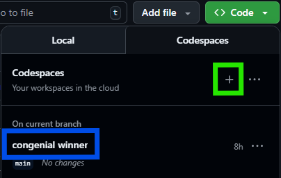
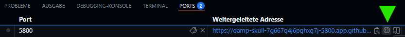

# How to run the Programm on Codespace

On the github page, click on the `<>Code` button and select your Codespace server in **main** branch (**blue**).  
If not existing, create a new Server (**green**).

 

 

In the new opened window, wait for arround 1-2 minutes (First startup only), so that the server can setup automatically.  
After that, in Terminal at the bottom, type `make app-up` and hit Enter.  
Wait for the server to load the programm. If any popup´s appear, allow them.  
In the bottom right of your screen, a popup should apper with a button `open in Browser...` - click on it to open the programm in a new tab.  
If you´ve misses the popup, goto `Ports` and open it manually.  

 

 

 

---
# 📄 Compatible files and content

The files have to be in **.csv** format *and* correct name syntax (see Key Features).

Necessary columns for evaluation (**only one** each type):
| Type | Column Name |
|------|-------------|
| Price | **last, mark**, price, close |
| Stock | **symbol**, ticker, name |
| Borrow Size | **approx borrow size** |

Additional columns and their order does´nt matter.

 

---

# 💾 File upload

To upload files for evaluation, go to your Codespace. Drag and drop the files into `data` folder.

 

---

# 📈 Approx Borrow Size Analysis

A powerful and intuitive **visual analytics suite** for exploring  
the relationship between **Price** and **Approx Borrow Size** in Thinkorswim.

This project combines:
- A robust Python backend for data parsing and visualization, and  
- A modern Tkinter GUI launcher for quick configuration and presets.

---

## 🧭 Overview

**Approx Borrow Size Analysis** loads multiple CSV snapshots exported from your trading watchlist *or* scanner in Thinkorswim, merges them by timestamp, and visualizes how **share availability** correlates with **price movement**.

It offers two complementary visual modes:

| Mode | Description |
|------|--------------|
| 🟩 **Overview Grid** | Multi-symbol dashboard with `Price`, `Borrow Size`, and cumulative `BZAP` |
| 🟦 **Detail Navigator** | Interactive symbol-by-symbol exploration with keyboard shortcuts |

The launcher (`watchlist_launcher_gui.py`) provides a complete GUI interface — no command line needed.

---

## ✨ Key Features

- 🔍 **Automatic CSV Detection**  
  Detects separators and header rows even in inconsistent files.
  
- 🧩 **Smart Column Recognition**  
  Finds the correct columns for *Symbol*, *Price* (Mark/Last/Close), and *Approx Borrow Size* automatically.
  - Displayes error messages in Output section, if anything can´t be processed.

- ⏱ **Two X-Axis Modes**  
  - `time`: true timeline (with spacing)  
  - `index`: equal spacing  

- ⚙️ **Dynamic Borrow Controls**  
  Borrow floor (`none`, `10th percentile`, `min`) and zoom factor to resize bar chart.

- 💹 **BZAP – Borrow Size Weighted Average Price**  
  - *BZAP (overall)* – global average  
  - *BZAP (cum.)* – cumulative average  
  - *BZAP (10-roll)* – rolling weighted means, it takes only the last 10 data pionts into acount

- 🎛 **Interactive Detail Navigation**
  | Key | Action |
  |-----|--------|
  | `A / D` or `← / →` | Previous / next symbol |
  | `Z` | Toggle Δ (Delta) / absolute borrow |
  | `+ / -` | Zoom in/out bottom range |
  | `X` | Cycle floor mode (none → p10 → min) |
  | `Q` | Quit detail view |

- 💾 **Preset System**  
  - Saves configuration automatically to `user_presets.json`  
  - Manual save from the GUI  
  - Persists between sessions

- ⏰ **Required data format**

  - 2023-10-24 or 2023_10_24 or 20231024 or 24-10-2023 or 24.10.2023
  - _08-30. or -08-30. or _0830. or -0830
  - .csv

    excample: `2023-10-24-08-30.csv` , `2023-10-24_0830.csv`
    
---

## 🪟 GUI Launcher

Run the GUI to configure everything interactively:

You can:

Browse for your analysis script and data folder

Adjust parameters (days, topN, ranking, modes, etc.)

Choose one of three run modes:

🟩 Run Overview only

🟦 Run Detail only

🟨 Run Both

The Command Preview updates live so you can see the exact CLI call.

---

🧮 The BZAP Formula

Borrow-Weighted Average Price (BZAP):

BZAP = ∑ (Price i ​× Borrow i​) / ∑ Borrow i​

---

| ---------------------Overview Grid--------------------- | ------------------------Detail View----------------------- |

|  |  |